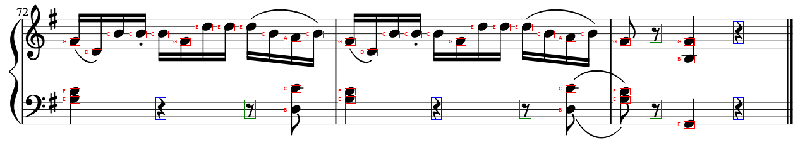
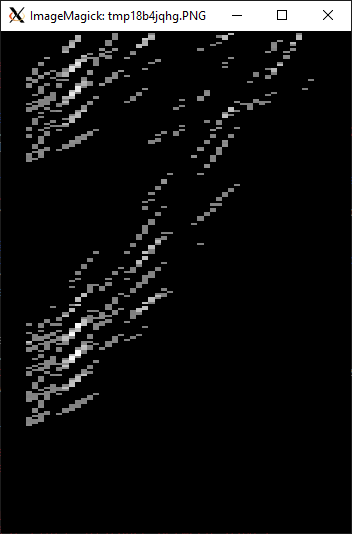

# Assignment 1: Image Processing and Recognition Basics
#### by: Andrew Corum, Josep Han, Kenneth Zhang, Zheng Chen
#### 03/28/2021

 <!-- Your report should explain how to run your code
and any design decisions or other assumptions you made -->

To run the code: in the command line, run: 
```python3 ./omr.py <file>```

This will use the hamming-distance note detection method by default. If you would like to specify which method, you can use:

<!-- ```python3 omr.py ./images/music1.png hamming``` -->
```python3 ./omr.py <file> hamming```
to run the hamming distance method, or 
```python3 ./omr.py <file> d_matrix```
to run the d_matrix method.

```<file>``` is the location of the music sheet.

The outputs should be two files: 

```detected.png , detected.txt```



### Design Decisions and Assumptions
As the assignment states, we assume that the music lines from the image are parallel and straight. This is in order to implement the Hough Transform for line detection. We also assumed that every lines are in treble clef. This is because the assignment did not provide a template model for treble or bass clefs. 

When applying convolutions, we assumed that the padding of the image should repeat the values found at the edges. This prevented the darkened halo effect on both our template images as well as the music sheets when applying Gaussians or Sobel kernels.

When detecting the staff lines, we decided to implement a naive thresholding, where if the pixel value is less than 78% (100% being white), then we convert that pixel to 0. This significantly helped the Hough Transform algorithm as there were less ambiguous pixels when applying the Sobel operator and non-maximal suppression.



The figure above shows the accumulator used by the Hough Transform on `images/music1.png`. The y axis represents the row of a stave, and the x axis is the spacing between the five staff lines.
From this image, you can see two major groupings (due to `music1.png` containing two staves). Addionally, the two brightest areas of these groupings occur at the same x location (which represents a staff line distance of 12 pixels).

### Performance of algorithms
#### Convolution
We have tested with Sobel operators and Gaussians, and the results looked identical to code packages from CV2. Since we made it compatible with separable 1D kernels, it is safe to assume that the runtime performance should be improved over 2D kernels.

<!-- #### Hamming Distance -->


#### Template Matching
The Hamming Distance calculation was not hard to implement, since it checks every pixel of the template with the given area of the image, much like convolution. However, we noticed that this would result in a less accurate note detection, where things like the circle in the treble clef would count as a note. 

The alternate approach suggested we take the edge maps of the image and templates before calculating the template matching values in a slightly different way. We found that this implementation is much slower compared to the Hamming distance method. But the accuracy of the template matching seems to perform better than with Hamming Distance for some instances such as eighth note detection. On the other hand, regular note template matching worked better on Hamming in our experiments.


#### NJIT 
Early in our work, we noticed that our code would not run as quickly as we thought it should, even with algorithm optimizations made such as using separable kernels during convolution. We discovered that in our work, numba's njit could help apply a JIT compiler to our code to increase the computation speed.

Here are some computation time comparisons:

Hamming Distance Time (in seconds)|No NJIT|With NJIT| % changed
------------ | ------------ | -------------|---------------
music1|84.35875154|0.0849998 | 992.4582388%
music2|158.1897514|0.14099884 | 1121.922358%
rach|N/A|0.708999872 | N/A

In row 1, you can see that there is 

D_Matrix time (in seconds) |No NJIT|With NJIT
------------ | ------------ | -------------
music1|~20 minutes|87.13685417175293

Evidently, NJIT was highly instrumental in allowing our code to run in manageable time.

### Future Work
The first thing we could look at to improve is to provide a way to detect the clefs of each staff. This would make the note detection more consistent to the true values. 

Our current output also has multiple overlapping boxes on the detected templates. We could mitigate this by using non-maximal suppression.

We could also experiment with different threshold values that the user could adjust when applying on different images.

### References
Specific references are documented within our code (in `omr.py`).
* PIL docs: https://pillow.readthedocs.io/en/stable/
* Numba docs: http://numba.pydata.org/numba-doc/latest/index.html
* Principles of Digital Image Processing (Burger, Burge 2009) Pages 50-63. (About Hough Transform).
* B657 Spring 2021 Course slides (found on Canvas)
* Towardsdatascience.com tutorial on Canny edge detection: https://towardsdatascience.com/canny-edge-detection-step-by-step-in-python-computer-vision-b49c3a2d8123
* Wikipedia summary of sobel operatory: https://en.wikipedia.org/wiki/Sobel_operator
* Medium.com summary of 2d convlutions: https://medium.com/analytics-vidhya/2d-convolution-using-python-numpy-43442ff5f381
* Adapted BFS code from Geeksforgeeks.org: https://www.geeksforgeeks.org/breadth-first-traversal-bfs-on-a-2d-array/
