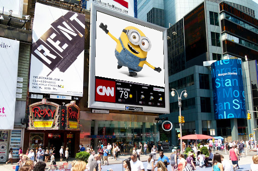

# Assignment 2:  Projective Transformation and Stereo Matching
#### by: Andrew Corum (amcorum), Josep Han (hanjos), Kenneth Zhang (zhangkf), Zheng Chen (zc11)
#### 05/01/2021
|Task | Contributor |
|---|---|
 Part 1 Homography|Josep Han|
 Part 2 Basic Stereo Matching|Andrew Corum|
 Part 2 Extra Credit|Zheng Chen|
 <!-- Your report should explain how to run your code
and any design decisions or other assumptions you made -->

## Part 1: Putting Happy Minions Faces on Empty Billboards of Times Square
Contributor: Josep Han

To run the code:
```python3 homography.py source_file, target_file, annot_file, output_name```
if the target image is annotated in blue,

```python3 homography.py source_file, target_file, annot_file, color, output_name```
if the target image is annotated in either green or red, in the ```color``` parameter.

```annot_file: the target file with the corners marked in color.``` 

A sample command would look like this:
```python .\homography.py .\source\happy_minions1.png .\target\empty_bilboard1.jpg  .\target\empty_bilboard1_annotated.jpg homography1.png```

### Design Decisions and Assumptions
#### Step 1 - Annotating 2D Point Correspondences
We decided to create a copy of the target image with the corners of the billboard indicated in a primary color (RGB) using Microsoft Paint. However, the images were in jpg, so even with solid coloring, the resulting image would return unexact RGB values at the places that we've colored. 

Therefore, we decided to implement a color detector that sets a threshold of more than 200 of a certain RGB value, and less than 50 for the other values of the given pixel, and collected the resulting clusters of points. Then, we implemented a K-means clustering to locate the four colored points in the annotated image.

Next, we run an ordering algorithm in order for the listed points to be in line with the corners listed from the source image.

An important assumption that we made was that there is no rotation involved in the homography. Therefore, the top two points in the target image will represent the top two points in the source image, and the same applies for the bottom two points. If different rotations or flipping is desired by the user, then in this repository, they will have to edit the images, either the source or target, before applying the homography.

#### Step 2 - Homography Estimation
This was by far the hardest part of this section. However, thanks to the permission to use the linear equation solver in NumPy, once we set up the correspondance matrix and the b-vector, the computation did not take long.

Because of the constraint of homography, the last element of the H matrix 1, and therefore the b vector also ends with a 1. Thus, a perfect square equation is found and np.linalg.solve can be used to the equations. 

When checking the correspondance points, we can notice that the w-vector in the projection points differs depending on the source corner point, and that vector is congruent to the vector in the target corners. We can conclude that the projection vector can be normalized using w found in the vector.

#### Step 3 - Apply Homography
We assume that if the source image is larger than the target image, it is safe to resize the source image to match the size of the target image. It is also safe to do so before finding the Homography matrix; we use the resized source image to calculate the matrix. 

Resizing allowed the third image homography to be completed in equal time with the other source images, since the projection loop depends on the source image sizes. 

### Performance




We can see that the KMeans clustering is giving good estimations of the corners of the billboards, and that the homography is working as intended for the given billboard images.

## Part 2: Stereo Matching
From within the `./part2/` directory, run `python3 stereo_matching.py <imageNum>`, where `<imageNum>`
is the directory number of the stereo images that you would like to analyze.
By default, this will use a 3x3 SSD window/patch size. To use a different size,
run `python3 stereo_matching.py <imageNum> -N {1,2,3,4,5,6,7,8,9}`.

Examples:
- `python3 stereo_matching.py 1` (will use 3x3 neighborhood on image 1)
- `python3 stereo_matching.py 2 -N 3` (will use 7x7 neighborhood on image 2)
- `python3 stereo_matching.py 4 -N 6` (will use 13x13 neighborhood on image 4)

Resulting disparity maps will be shown in a popup window, as well as saved within the `./part2/<imageNum>/` directory. Two evaluation metrics for the predicted disparity map will be printed.

### Design Decision and Assumptions
To predict disparity at each pixel *P*, we use the basic matching algorithm.
This involves looking at a neighborhood *N1* around *P*, then comparing it with all other neighborhoods *N2* in the same scanline as *P*. 

This process is based on a couple assumptions:
- The cameras which captured the 'left' and 'right' images differed only in
  their horizontal positions in the world. This allows us to assume that any point in the 'left' image will appear at the same *y* position in the 'right'
  image. (In one of our class assignments, showed this is a direct result of epipolar geometry).
- The neighborhood *N2* in the 'left' image, which best matches a neighborhood
  *N1* around *P* in the 'right' image, comes from the same point in the world.
  This is a much less reasonable assumption than the first. In fact, it is often
  wrong. But it is a good first attempt at finding matching pixels in the two 
  images. To improve this, it would be better to make a couple other assumptions
  about how disparities of neighboring points relate to each other. This can be done using HMMs along scanlines, or even an MRF over the entire image.

We added the `-N` flag to control to the size of the neighborhood/patch/window.
Increasing the size of the neighborhood seems to give a smoother, less noisy prediction of disparity, at the cost of elevated computation time.

The basic matching algorithm is fairly slow, as it has to check every neighborhood in the scanline for every pixel in the image.
This ends up being an *O(W H^2 N^2)*, where *W* is the width, *H* is the height, and *N* is the size of the neighborhood. We could have reduced image size to reduce the running time. However, instead we applied the Numba library, which gives us a "just in time" compiler. This greatly improves the speed of our python code.

After computing the predicted disparity map, we convert the result to an image and save it. We use both a grayscale image and a colored one. 

Then, to evaluate the performance of our predicted disparity map, we implemented a couple evaluation metrics. We compute the "end point error" and the "3px error rate".
We use the provided ground-truth images to evaluate our results. Higher "end point error" or "3px error rate" values indicate a less accurate prediction.
Generally, we find that increasing the patch/window size of the basic matching algorithm improves its performance.

### Some Results

|Image|Ground Truth|
|---|---|
||  |


|Window|EPE|ERR|Grayscale Disp|Color Disp| 
|--- | --- | ---|---|--- |
 3x3 |27.1|65.1|  | 
 5x5 |12.1|36.0|  | 
 7x7 |7.96|27.2|  | 
 9x9 |7.46|25.6|  | 

--------------------------

|Image|Ground Truth|
|---|---|
||  |


|Window|EPE|ERR|Grayscale Disp|Color Disp| 
|--- | --- | ---|---|--- |
 3x3 |34.1|67.8|  | 
 5x5 |27.0|57.4|  | 
 7x7 |24.9|53.6|  | 
 9x9 |24.1|51.6|  | 

-------------------------

|Image|Ground Truth|
|---|---|
||  |


|Window|EPE|ERR|Grayscale Disp|Color Disp| 
|--- | --- | ---|---|--- |
 3x3 |31.5|67.8|  | 
 5x5 |20.0|54.4|  | 
 7x7 |18.5|52.5|  | 
 9x9 |18.3|52.2|  | 

--------------------

|Image|Ground Truth|
|---|---|
||  |


|Window|EPE|ERR|Grayscale Disp|Color Disp| 
|--- | --- | ---|---|--- |
 3x3 |30.2|67.0|  | 
 5x5 |22.6|53.1|  | 
 7x7 |21.1|48.6|  | 
 9x9 |20.9|46.6|  | 

-------------

The results are definitely not perfect. The computed disparity maps are very noisy. However, they are better than nothing. We can see, in general, closer objects getting larger disparity values in the predicted disparity maps. The basic matching algorithm seems to do better with larger / less complicated objects (like in image 1 or image 2). Also, we see better/smoother performance as the window size increases, which is to be expected. 

### Stereo Matching with Belief Propagation
To further smooth the disparity image obtained from the naive stereo matching, we also implement the belief propagation algorithm introduced in Module 9.8 (see in `part2/stereo_matching_hmm.py`). In current implementation, we use the linear model as our distance function. However, we cannot run the current implementation as expected because it has too high complexity. More improvements are required to make it work.

### References
Specific references are documented within our code (`homography.py` in part1).
* PIL docs: https://pillow.readthedocs.io/en/stable/
* Numba docs: http://numba.pydata.org/numba-doc/latest/index.html
* B657 Spring 2021 Course slides (found on Canvas)
* KMeans algorithm: https://scikit-learn.org/stable/modules/generated/sklearn.cluster.KMeans.html
* Homography matrix calculation: https://math.stackexchange.com/questions/494238/how-to-compute-homography-matrix-h-from-corresponding-points-2d-2d-planar-homog
* argparse docs https://docs.python.org/3/howto/argparse.html
